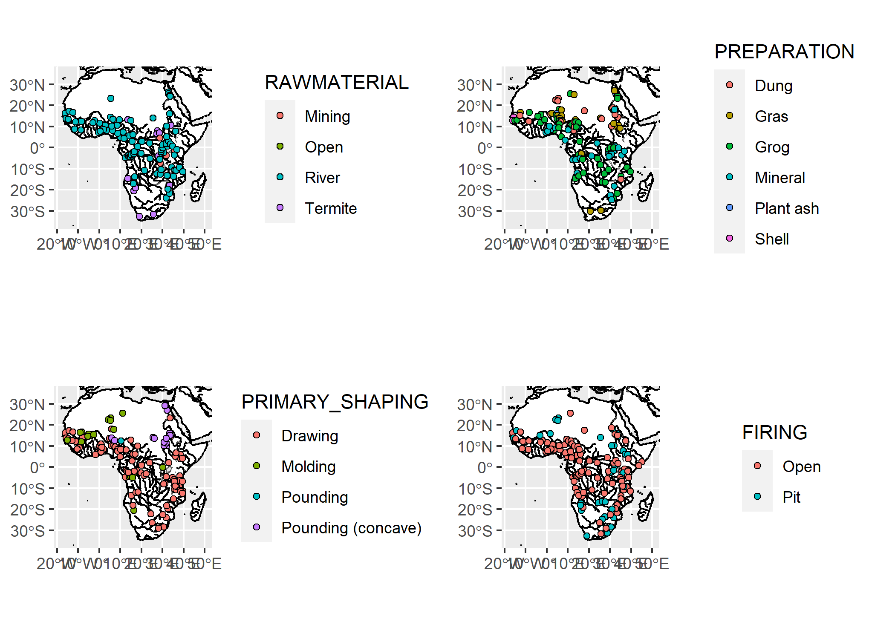
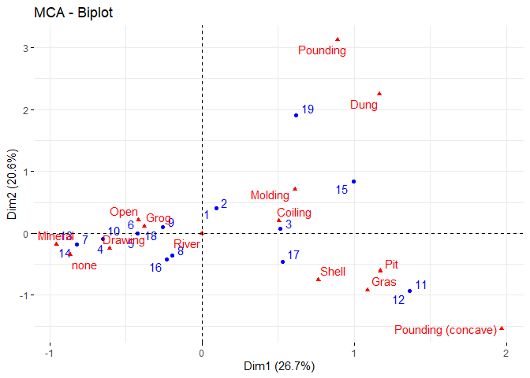

# Drost 1967 “Töpferei in Afrika”

------------------------------------------------------------------------

> :warning: **Warning:** This repository is still work-in-progress!!

------------------------------------------------------------------------

This repository contains geo-referenced information on potters’
communities throughout Africa.

The maps were geo-references using QGIS (v3.22.1-Białowieża) relying on
nine manually set reference points (tranformations parameters:
Polynomial 3 & cubic spline) into EPSG:4326 CRS.

## Stages of the *chaîne opératoire*

The following stages of the *chaîne opératoire* were recorded:

| Stage             | Description                                                  | Source           |
|-------------------|--------------------------------------------------------------|------------------|
| RAWMATERIAL       | Raw material sources (fluvial/river, termite mounds, mining) | p. 19 map 1      |
| PREPARATION       | Raw material preperation                                     | p. 33 map 2      |
| PRIMARY_SHAPING   | Primary shaping technique                                    | p. 55-79 map 3-6 |
| SECONDARY_SHAPING | Secondary shaping technique                                  | p. 55-79 map 3-6 |
| FIRING            | Firing                                                       | p. 217 map 17    |

## Maps

## Collective *chaînes opératoires*

<!-- -->
